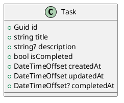

# Personal Task List Data Model

## Overview

The Personal Task List API uses one domain entity: `Task`.

`Task` represents a single item in the personal task list. The model is intentionally minimal so the database schema and API payloads match the challenge scope.

Out of scope:

- Users and authentication fields.
- Projects, categories, tags, and labels.
- Priorities, due dates, reminders, and recurrence.
- Task sharing or team ownership.

## Entity: Task

| Field | Type | Required | Default | Description |
| --- | --- | --- | --- | --- |
| `id` | `Guid` | Yes | Generated by the API | Unique task identifier. |
| `title` | `string` | Yes | None | Short task title provided by the caller. |
| `description` | `string?` | No | `null` | Optional task details provided by the caller. |
| `isCompleted` | `bool` | Yes | `false` | Indicates whether the task has been completed. |
| `createdAt` | `DateTimeOffset` | Yes | Current API time | Timestamp set when the task is created. |
| `updatedAt` | `DateTimeOffset` | Yes | Current API time | Timestamp set when the task is created or changed. |
| `completedAt` | `DateTimeOffset?` | No | `null` | Timestamp set when the task is completed. |

## Validation Rules

- `id` is generated by the API and must be unique.
- `title` is required and must not be blank.
- `description` is optional. If omitted, it should be stored as `null`.
- `isCompleted` defaults to `false` for new tasks.
- `createdAt` is set by the API when the task is created and should not be changed by clients.
- `updatedAt` is set by the API when the task is created and whenever editable task data changes.
- `completedAt` is `null` until the task is completed.
- When a task is completed, `isCompleted` is set to `true`, `completedAt` is set to the completion timestamp, and `updatedAt` is updated.

## EF Core Implementation Notes

The model can be implemented directly as an Entity Framework Core entity.

| Field | EF Core Guidance |
| --- | --- |
| `id` | Primary key. |
| `title` | Required column. |
| `description` | Nullable column. |
| `isCompleted` | Required column with default value `false`. |
| `createdAt` | Required column populated by application code. |
| `updatedAt` | Required column populated by application code. |
| `completedAt` | Nullable column populated by application code. |

## PlantUML Diagram

