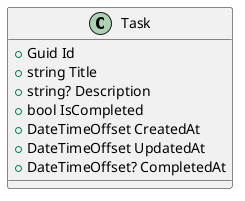
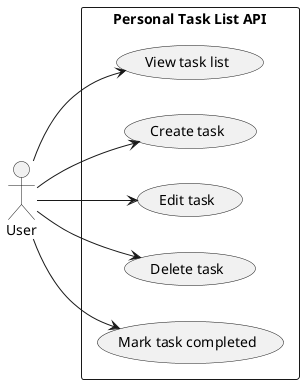

# SW Challenge 1 Breakdown

## What The Challenge Is Asking For

This challenge is not mainly asking us to build a complex task management system. It is asking us to practice **Spec-Driven Development (SDD)**.

That means the expected order is:

1. Write the specification first.
2. Make the specification clear enough that the API can be built from it.
3. Build only what the specification says.
4. Avoid extra features that are not described in the specification.

The application itself is intentionally simple: a **Personal Task List** where a user can:

- create tasks
- edit tasks
- delete tasks
- mark tasks as completed
- see the task list

There is no authentication required.

## Required Deliverables

The requirement says the repository must contain at least:

| Deliverable | File | Purpose |
| --- | --- | --- |
| Vision document | `docs/vision.md` | Explain what the app is, who it is for, and what problem it solves. |
| User stories | `docs/user-stories.md` | Describe expected behavior from the user's point of view. |
| Acceptance criteria | Inside `docs/user-stories.md` | Use Gherkin-style scenarios: Given, When, Then. |
| Data model diagram | `docs/data-model.md` | Define the data shape before coding. |
| OpenAPI contract | `docs/openapi.yaml` | Define the API endpoints, requests, responses, and errors. |
| Prompts used | Suggested: `docs/prompts.md` | Record the LLM prompts used during the challenge. |
| API implementation | C# Web API project | Implement exactly the OpenAPI contract. |
| Unit tests | Test project | Verify the behavior described by the specification. |

## Recommended Technical Stack

Since we are using C#, a clean and realistic stack would be:

- ASP.NET Core Web API
- Entity Framework Core
- SQLite
- EF Core migrations
- xUnit, NUnit, or MSTest for tests
- Swagger/OpenAPI generation, while still keeping `docs/openapi.yaml` as the source contract

SQLite is a good choice for this challenge because it behaves like a real database, supports migrations, and keeps local setup simple.

## What We Should Build

The smallest useful domain model is a single `Task` entity.

Suggested fields:

| Field | Type | Required | Notes |
| --- | --- | --- | --- |
| `id` | `Guid` or `int` | Yes | Unique task identifier. |
| `title` | `string` | Yes | Main task text. |
| `description` | `string?` | No | Optional additional details. |
| `isCompleted` | `bool` | Yes | Whether the task is completed. Defaults to `false`. |
| `createdAt` | `DateTimeOffset` | Yes | Creation timestamp. |
| `updatedAt` | `DateTimeOffset` | Yes | Last update timestamp. |
| `completedAt` | `DateTimeOffset?` | No | Set when the task is marked completed. |

We should avoid adding users, projects, categories, priorities, due dates, reminders, authentication, authorization, or multiple task lists unless the specification is intentionally expanded. The challenge asks for a personal task list, not a full productivity platform.

## Suggested Data Model Diagram

This diagram is enough for the initial challenge because there is only one main entity.



## Recommended Endpoint Count

I recommend **5 endpoints** for the first version.

These endpoints cover exactly what the challenge asks for without adding unnecessary API surface:

| Method | Endpoint | Purpose | Required By |
| --- | --- | --- | --- |
| `GET` | `/api/tasks` | Get the task list. | The app needs to show tasks in a task list. |
| `POST` | `/api/tasks` | Create a task. | "create" |
| `PUT` | `/api/tasks/{id}` | Edit a task. | "edit" |
| `PATCH` | `/api/tasks/{id}/complete` | Mark a task as completed. | "mark tasks as completed" |
| `DELETE` | `/api/tasks/{id}` | Delete a task. | "delete" |

### Why Not More Endpoints?

We could add `GET /api/tasks/{id}`, but the requirement does not clearly need it. A personal task list can be implemented with `GET /api/tasks` plus update/delete/complete operations by id.

For this challenge, fewer endpoints are better if they fully satisfy the specification. The requirement explicitly says the API should expose exactly the endpoints and commands described in the specification.

If we decide that viewing a single task is useful, we can include it in the specification and OpenAPI contract, but then we must also implement and test it. That would make the API **6 endpoints**:

| Method | Endpoint | Purpose |
| --- | --- | --- |
| `GET` | `/api/tasks/{id}` | Get one task by id. |

My recommendation is to start with **5 endpoints** and only add `GET /api/tasks/{id}` if our user stories require a detailed task view.

## Suggested API Behavior

### `GET /api/tasks`

Returns all tasks.

Recommended response:

- `200 OK`
- Body: array of tasks

Optional query filters should be avoided in version 1 unless specified.

### `POST /api/tasks`

Creates a new task.

Recommended request body:

```json
{
  "title": "Buy groceries",
  "description": "Milk, eggs, bread"
}
```

Recommended responses:

- `201 Created` when the task is created
- `400 Bad Request` when required data is invalid

### `PUT /api/tasks/{id}`

Edits an existing task.

Recommended request body:

```json
{
  "title": "Buy groceries and coffee",
  "description": "Milk, eggs, bread, coffee"
}
```

Recommended responses:

- `200 OK` with the updated task
- `400 Bad Request` when input is invalid
- `404 Not Found` when the task does not exist

This endpoint should not be responsible for completing the task. Completion has its own command.

### `PATCH /api/tasks/{id}/complete`

Marks a task as completed.

Recommended responses:

- `200 OK` with the completed task
- `404 Not Found` when the task does not exist
- `409 Conflict` if we decide completing an already completed task should be treated as an invalid state transition

Simpler alternative: if a task is already completed, return `200 OK` with the current task. This is easier and idempotent.

### `DELETE /api/tasks/{id}`

Deletes a task.

Recommended responses:

- `204 No Content` when deleted
- `404 Not Found` when the task does not exist

## Suggested User Stories

These are the core stories the challenge implies:

1. As a user, I want to see my task list so that I know what I need to do.
2. As a user, I want to create a task so that I can track something I need to complete.
3. As a user, I want to edit a task so that I can correct or update its details.
4. As a user, I want to delete a task so that I can remove tasks I no longer need.
5. As a user, I want to mark a task as completed so that I can track what I have finished.

## Suggested Use Case Diagram

This diagram helps visualize the required behavior without overcomplicating the system.



## Priority Order

### 1. Specification First

Create the required documentation before coding:

1. `docs/vision.md`
2. `docs/user-stories.md`
3. `docs/data-model.md`
4. `docs/openapi.yaml`
5. `docs/prompts.md`

This is the most important part of the challenge because the goal is SDD.

### 2. Lock The API Contract

Define the exact endpoints, request bodies, response bodies, status codes, and validation rules in `docs/openapi.yaml`.

Once this is done, the code should follow the contract. We should avoid changing the API casually during implementation.

### 3. Create The C# Solution

Suggested structure:

```text
src/
  PersonalTaskList.Api/
tests/
  PersonalTaskList.Api.Tests/
docs/
  vision.md
  user-stories.md
  data-model.md
  openapi.yaml
  prompts.md
```

### 4. Build The Data Layer

Create:

- `Task` entity
- EF Core `DbContext`
- SQLite connection
- initial migration
- database update flow

### 5. Build The API Endpoints

Implement only the endpoints defined in `docs/openapi.yaml`.

Recommended implementation order:

1. `POST /api/tasks`
2. `GET /api/tasks`
3. `PUT /api/tasks/{id}`
4. `PATCH /api/tasks/{id}/complete`
5. `DELETE /api/tasks/{id}`

This order lets us create data first, then read it, then modify it.

### 6. Add Tests

Tests should prove the specification is followed.

Minimum useful tests:

- create task succeeds with valid data
- create task fails with missing title
- list tasks returns created tasks
- edit task updates title and description
- edit task returns `404` for missing task
- complete task sets `isCompleted` to `true`
- delete task removes the task
- delete task returns `404` for missing task

### 7. Final Verification

Before submitting:

- confirm all required docs exist
- confirm OpenAPI matches the implemented endpoints
- run all tests
- confirm migrations work against SQLite
- confirm there are no extra endpoints beyond the contract

## Key Decision To Make Early

The most important early decision is whether the API has **5 endpoints** or **6 endpoints**.

Recommended decision: **5 endpoints**.

Reason: it satisfies the challenge and keeps the contract minimal.

Add `GET /api/tasks/{id}` only if we explicitly write a user story that requires viewing one task by itself.
